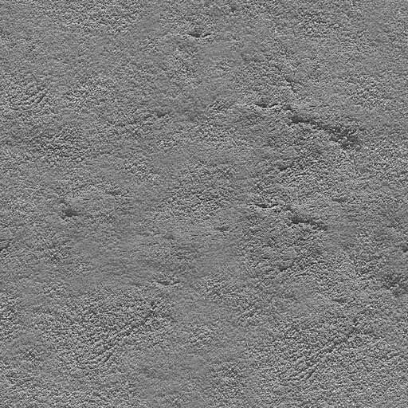
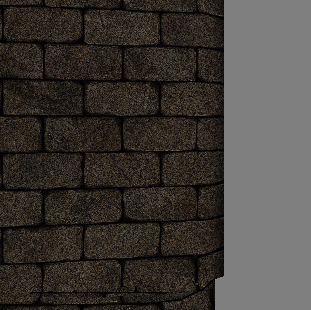
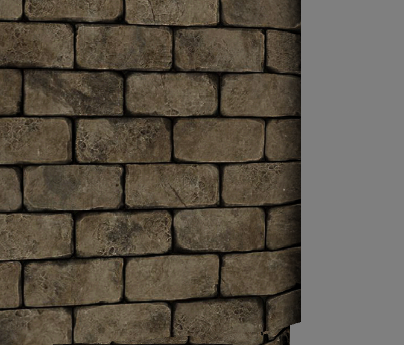
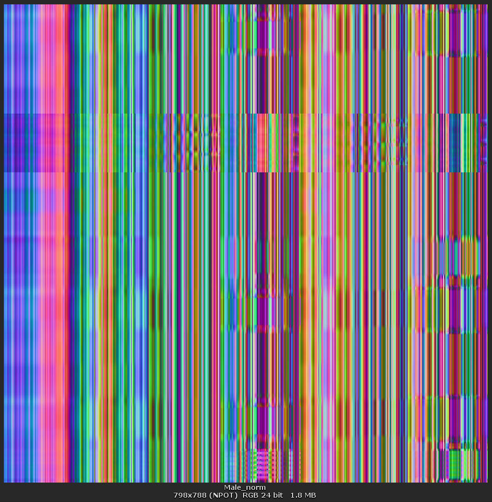
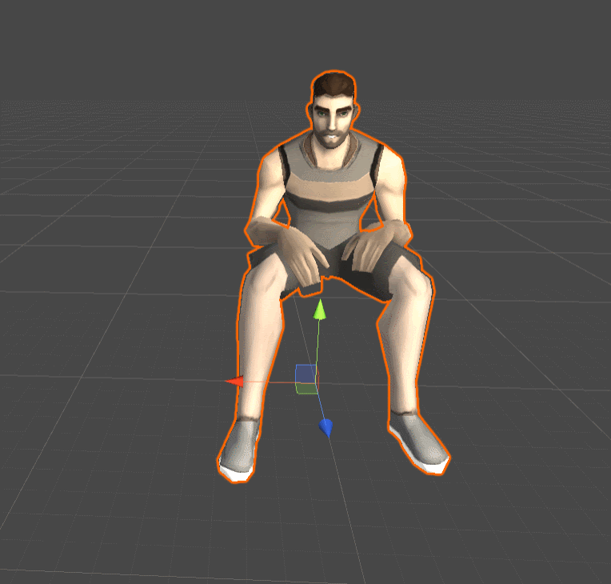
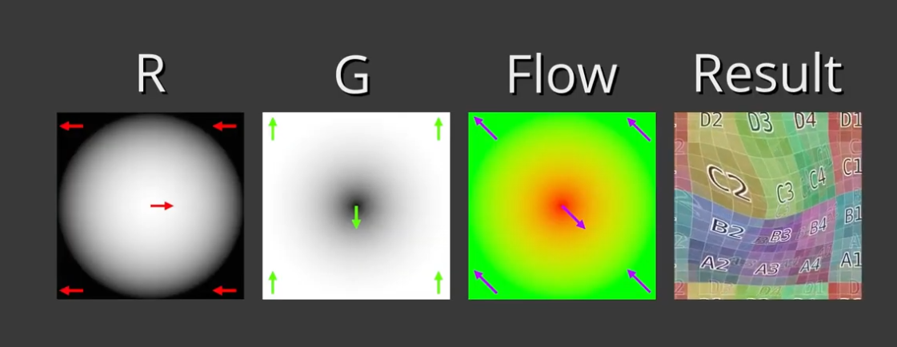
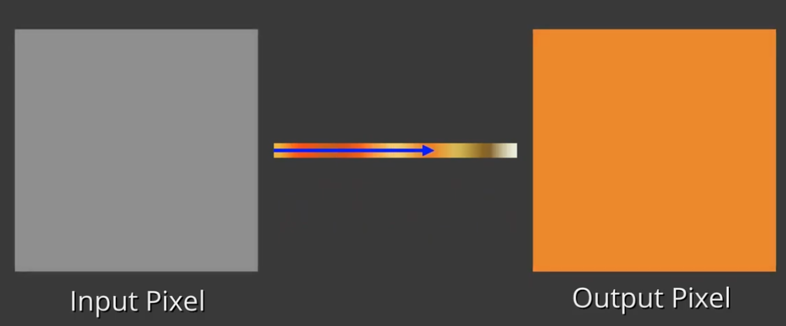

# Shader textures and techniques
This article is a data base of all texture and technique used in shader to create effect. It is usefull to learn, inspirate, give detail and link to go further. 
Help this article to grow up and become a solide resource for graphic programmers.

-------------
## Summary
- [Albedo](##-Albedo-/-Diffuse-color-/-Base-color: "Goto albedo part")
- [VAT (vertex animation texture)](##-VAT-(vertex-animation-texture): "Goto VAT part")
- [Flow map](##-Flow-map: "Goto flow map: part")
- [Gradient map](##-Gradient-map: "Goto gradient map part")
- [Transform color thanks to matrix](##-Transform-color-thanks-to-matrix: "Goto gradient map part")
- [Contributor](##-Contributor "Goto contributor part")
-------------

## Albedo / Diffuse color / Base color:
### Description:
Texture that store the brut color of the pixel

-------------------

-------------------

## Detail mapping:
### Description:
Texture that store a noise effect and that will be usefull to avoid flat aspect of nearest texture. This effect give the illusion that the texture containe more detail.

### Characteristics:
- Monochrome
- Blended with albedo
- Can be small and tiled

### Example:
With                                                      |          Without
-------------                                             | -------------
     | 

### Link:
<li><a href="https://www.rastertek.com/tertut13.html" target="_blank">Project example with detail mapping</a></li>
-------------------

-------------------

## VAT (vertex animation texture):
### Description:
Texture that store animation. Each pixel is the local position (or normal) of a vertex. All vertex is in line and animation key correspond to the row. 

### Characteristics:
- RGB
- GPU animation only (static mesh in CPU)
- Avoid data transfer fro CPU to GPU
- Without bone (without link for colllider, object...). Great for background animation
- Blend is possible with another VAT

### Link:
<li><a href="https://medium.com/tech-at-wildlife-studios/texture-animation-techniques-1daecb316657#" target="_blank">Article and main reference about this technique</a></li>
<li><a href="https://www.youtube.com/watch?v=NQ5Dllbxbz4" target="_blank">A wonderfull video about this technique</a></li>
-------------------

-------------------
## Flow map:
### Description:
Flow map is a texture that allow user to create movement thanks to the UV.
This technical is based on the UV tiling but with more complexe movement

### Characteristics:
- R, RG, RGB, RGBA

### Link:
<li><a href="https://www.youtube.com/watch?v=KfphtLRoUB0" target="_blank">A wonderfull video about this technique</a></li>

-------------------

-------------------
## Gradient map:
### Description:
Gradiant map is a technical to color monochrome texture fastly and with flexibilty. User can change the gradient map to obtain differentes color effects.

### Characteristics:
- RGB, RGBA

### Link:
<li><a href="https://www.youtube.com/watch?v=KfphtLRoUB0" target="_blank">A wonderfull video about this technique</a></li>

-------------------

-------------------
## Transform color thanks to matrix:
### Description:
Matrices can be use to translate, rotate, scale, shrink a vector. Color is a vector and this rule can be applyed to it.

-------------------

## Contributor
- Jonathan Six
